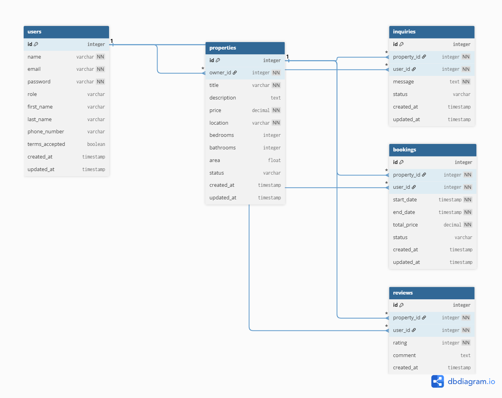

<p align="center">
  
</p>

<h1 align="center">MaskanX — مسكن إكس</h1>

<p align="center">
  <strong>Next-Generation Real Estate Platform</strong><br/>
  <em>Advanced Web Programming (AWP) — University Project</em>
</p>

<p align="center">
  
  
  
  
  
  
</p>

<p align="center">
  
  
  
</p>

---

## 📋 Table of Contents

- [Overview](#-overview)
- [System Architecture](#-system-architecture)
- [Tech Stack](#-tech-stack)
- [Features](#-features)
- [Database Design](#-database-design-erd)
- [API Reference](#-api-reference)
- [Getting Started](#-getting-started)
- [Project Structure](#-project-structure)
- [Security Implementation](#-security-implementation)
- [Screenshots](#-screenshots)
- [License](#-license)

---

## 🏠 Overview

**MaskanX** (مسكن إكس) is a full-stack, enterprise-grade real estate platform designed for the modern property market. The name combines *"Maskan"* (مسكن — Arabic for *dwelling*) with **X** — symbolizing next-generation technology.

Built with a strict **MVC architecture**, the platform empowers users to browse, list, book, review, and inquire about real estate properties — all backed by robust JWT authentication, role-based access control, and comprehensive API documentation.

### 🎯 Project Goals

| Goal | Description |
|------|-------------|
| **Full-Stack Mastery** | Demonstrate end-to-end proficiency in modern web development |
| **Security-First** | Implement industry-standard authentication & authorization patterns |
| **Clean Architecture** | Enforce strict MVC with Services layer separation |
| **API Documentation** | Auto-generate interactive Swagger docs from code annotations |
| **Production Quality** | Rate limiting, input validation, structured logging, error handling |

---

## 🏗 System Architecture

```
┌─────────────────────────────────────────────────────────────────────┐
│                        CLIENT BROWSER                              │
│                     (Next.js SSR + CSR)                             │
└──────────────────────────┬──────────────────────────────────────────┘
                           │  HTTP/HTTPS
                           ▼
┌─────────────────────────────────────────────────────────────────────┐
│                      NEXT.JS FRONTEND                              │
│  ┌──────────┐  ┌──────────┐  ┌──────────┐  ┌──────────────────┐   │
│  │  Pages/   │  │Components│  │  Redux   │  │    Services      │   │
│  │  Routing  │  │  (UI)    │  │  Store   │  │  (Axios Client)  │   │
│  └──────────┘  └──────────┘  └──────────┘  └────────┬─────────┘   │
│                                                      │             │
└──────────────────────────────────────────────────────┼─────────────┘
                                                       │ REST API
                                                       ▼
┌─────────────────────────────────────────────────────────────────────┐
│                      EXPRESS BACKEND                               │
│                                                                     │
│  ┌──────────┐  ┌──────────────┐  ┌─────────────────────────────┐   │
│  │  Morgan   │  │ Rate Limiter │  │     CORS Middleware         │   │
│  │  Logger   │  │  (100/15min) │  │  (Origin Whitelisting)     │   │
│  └──────────┘  └──────────────┘  └─────────────────────────────┘   │
│                                                                     │
│  ┌─────────────────────────────────────────────────────────────┐   │
│  │                    ROUTES LAYER                              │   │
│  │  auth • properties • bookings • reviews • inquiries • stats │   │
│  └─────────────────────────┬───────────────────────────────────┘   │
│                             │                                       │
│  ┌─────────────────────────▼───────────────────────────────────┐   │
│  │               CONTROLLERS LAYER (Request Handling)           │   │
│  │  AuthController • PropertyController • BookingController     │   │
│  │  InquiryController • ReviewController                        │   │
│  └─────────────────────────┬───────────────────────────────────┘   │
│                             │                                       │
│  ┌─────────────────────────▼───────────────────────────────────┐   │
│  │               SERVICES LAYER (Business Logic)                │   │
│  │  AuthService • PropertyService • BookingService              │   │
│  │  InquiryService • ReviewService                              │   │
│  └─────────────────────────┬───────────────────────────────────┘   │
│                             │                                       │
│  ┌─────────────────────────▼───────────────────────────────────┐   │
│  │              MODELS LAYER (Sequelize ORM)                    │   │
│  │  User • Property • Booking • Review • Inquiry                │   │
│  └─────────────────────────┬───────────────────────────────────┘   │
│                             │                                       │
└─────────────────────────────┼───────────────────────────────────────┘
                              │ SQL
                              ▼
                    ┌──────────────────┐
                    │   PostgreSQL DB  │
                    │  (5 Tables, FK   │
                    │   Constraints)   │
                    └──────────────────┘
```

---

## 🛠 Tech Stack

### Frontend Ecosystem

| Technology | Version | Purpose |
|:-----------|:--------|:--------|
| **Next.js** | 16.x | React framework with SSR/SSG |
| **React** | 18.x | Component-based UI library |
| **TypeScript** | 5.x | Type-safe JavaScript |
| **Redux Toolkit** | 2.x | Global state management |
| **Tailwind CSS** | 3.x | Utility-first CSS framework |
| **SCSS** | — | Advanced stylesheets |
| **Framer Motion** | 12.x | Declarative animations |
| **Axios** | 1.x | HTTP client for API calls |
| **React Hook Form** | 7.x | Performant form handling |
| **Yup** | 1.x | Schema-based form validation |

### Backend Ecosystem

| Technology | Version | Purpose |
|:-----------|:--------|:--------|
| **Node.js** | 20+ | JavaScript runtime |
| **Express.js** | 4.x | Web framework |
| **TypeScript** | 5.x | Type-safe server code |
| **Sequelize** | 6.x | PostgreSQL ORM |
| **PostgreSQL** | 16.x | Relational database |
| **JWT** | 9.x | Token-based authentication |
| **bcryptjs** | 3.x | Password hashing (12 rounds) |
| **Zod** | 3.x | Runtime input validation |
| **Swagger** | 6.x | OpenAPI 3.0 documentation |
| **Winston** | 3.x | Structured logging |
| **Morgan** | 1.x | HTTP request logging |

---

## ✨ Features

### 🔐 Authentication & Authorization
- JWT-based stateless authentication with configurable expiry
- bcrypt password hashing with salt rounds
- Role-based access control (Admin / User)
- Protected route middleware with token verification
- Auth guard on frontend with redirect logic

### 🏡 Property Management
- Full CRUD operations for property listings
- Advanced filtering (location, price range, bedrooms, status)
- Pagination with configurable page sizes
- Owner-restricted edit/delete operations
- Property status management (available / sold / rented)

### 📅 Booking System
- Schedule property viewings with date ranges
- Automatic price calculation
- Status tracking (pending → confirmed → cancelled)
- User-specific booking history

### ⭐ Reviews & Ratings
- Property rating system (1–5 stars)
- Text reviews with author attribution
- One review per user per property enforcement

### 📩 Inquiry System
- Contact property owners through the platform
- Inquiry status management (pending / responded / closed)
- Message threading per property

### 📊 Admin Dashboard
- Real-time statistics (total properties, available listings, inquiries)
- Property management panel
- User profile management with editable fields
- Interactive charts and data visualization

---

## 📐 Database Design (ERD)

<p align="center">
  
</p>

### Relationships

```
  User (1) ──────< (*) Property      A user can own many properties
  User (1) ──────< (*) Booking       A user can make many bookings
  User (1) ──────< (*) Review        A user can write many reviews
  User (1) ──────< (*) Inquiry       A user can send many inquiries
  Property (1) ──< (*) Booking       A property can have many bookings
  Property (1) ──< (*) Review        A property can receive many reviews
  Property (1) ──< (*) Inquiry       A property can receive many inquiries
```

### Tables Summary

| Table | Key Columns | Constraints |
|:------|:------------|:------------|
| `users` | id, name, email, password, role | email UNIQUE, password NOT NULL |
| `properties` | id, title, price, location, owner_id | FK → users, price NOT NULL |
| `bookings` | id, property_id, user_id, start_date, end_date | FK → users, FK → properties |
| `reviews` | id, property_id, user_id, rating, comment | FK → users, FK → properties |
| `inquiries` | id, property_id, user_id, message, status | FK → users, FK → properties |

---

## 📡 API Reference

> 📖 **Interactive documentation available at** [`http://localhost:5000/api-docs`](http://localhost:5000/api-docs) **(Swagger UI)**

### Base URL: `http://localhost:5000/api`

### Authentication

| Method | Endpoint | Description | Auth |
|:-------|:---------|:------------|:-----|
| `POST` | `/auth/register` | Create new account | ❌ |
| `POST` | `/auth/login` | Login & receive JWT | ❌ |

### User Profile

| Method | Endpoint | Description | Auth |
|:-------|:---------|:------------|:-----|
| `GET` | `/profile` | Get current user profile | 🔒 |
| `PUT` | `/profile` | Update profile fields | 🔒 |

### Properties

| Method | Endpoint | Description | Auth |
|:-------|:---------|:------------|:-----|
| `GET` | `/properties` | List all (paginated) | ❌ |
| `GET` | `/properties/:id` | Get single property | ❌ |
| `POST` | `/properties` | Create new listing | 🔒 |
| `PUT` | `/properties/:id` | Update listing (owner only) | 🔒 |
| `DELETE` | `/properties/:id` | Delete listing (owner only) | 🔒 |

### Bookings

| Method | Endpoint | Description | Auth |
|:-------|:---------|:------------|:-----|
| `GET` | `/bookings` | List user's bookings | 🔒 |
| `POST` | `/bookings` | Create a booking | 🔒 |

### Reviews

| Method | Endpoint | Description | Auth |
|:-------|:---------|:------------|:-----|
| `GET` | `/reviews/:propertyId` | Get property reviews | ❌ |
| `POST` | `/reviews` | Submit a review | 🔒 |

### Inquiries

| Method | Endpoint | Description | Auth |
|:-------|:---------|:------------|:-----|
| `GET` | `/inquiries` | List user's inquiries | 🔒 |
| `POST` | `/inquiries` | Send an inquiry | 🔒 |

### Statistics

| Method | Endpoint | Description | Auth |
|:-------|:---------|:------------|:-----|
| `GET` | `/stats` | Dashboard statistics | 🔒 |

> 🔒 = Requires `Authorization: Bearer <token>` header

### Example Request

```bash
# Register a new user
curl -X POST http://localhost:5000/api/auth/register \
  -H "Content-Type: application/json" \
  -d '{
    "name": "Ahmad",
    "email": "ahmad@example.com",
    "password": "SecurePass123!",
    "termsAccepted": true
  }'

# Response
{
  "message": "User registered successfully",
  "token": "eyJhbGciOiJIUzI1NiIs..."
}
```

---

## 🚀 Getting Started

### Prerequisites

| Requirement | Minimum Version |
|:------------|:----------------|
| Node.js | v18.0+ |
| npm | v9.0+ |
| PostgreSQL | v14.0+ |
| Git | v2.30+ |

### 1️⃣ Clone the Repository

```bash
git clone https://github.com/abdo-saleh665/MaskanX.git
cd MaskanX
```

### 2️⃣ Configure Environment Variables

Create `real-estate-backend/.env`:

```env
PORT=5000
DB_NAME=maskanx_db
DB_USER=postgres
DB_PASSWORD=your_postgres_password
DB_HOST=127.0.0.1
DB_PORT=5432
DB_DIALECT=postgres

JWT_SECRET=your_super_secret_jwt_key_here
```

> ⚠️ **Never commit `.env` files** — they are excluded via `.gitignore`

### 3️⃣ Setup PostgreSQL Database

```sql
-- Connect to PostgreSQL and create the database
CREATE DATABASE maskanx_db;
```

### 4️⃣ Install Dependencies & Run

```bash
# Install frontend dependencies
npm install

# Install backend dependencies
cd real-estate-backend
npm install
cd ..

# Option A: Run both simultaneously
npm run dev:all

# Option B: Run separately (in two terminals)
npm run frontend    # → http://localhost:3000
npm run backend     # → http://localhost:5000
```

### 5️⃣ Verify

| Service | URL | Expected |
|:--------|:----|:---------|
| Frontend | http://localhost:3000 | MaskanX homepage |
| Backend API | http://localhost:5000/api/properties | JSON property list |
| Swagger Docs | http://localhost:5000/api-docs | Interactive API docs |

---

## 📁 Project Structure

```
MaskanX/
├── public/                          # Static assets
│   ├── assets/
│   │   ├── css/                     # Compiled stylesheets
│   │   ├── fonts/                   # Custom web fonts
│   │   ├── images/                  # Property images, logos, icons
│   │   └── scss/                    # SCSS source files (29 partials)
│   └── favicon.png
│
├── src/                             # Frontend source code
│   ├── app/                         # Next.js App Router pages
│   │   ├── (dashboard)/             # Dashboard route group
│   │   ├── contact/                 # Contact page
│   │   ├── listing_01..17/          # Property listing variants
│   │   ├── listing_details_01..06/  # Property detail variants
│   │   ├── layout.tsx               # Root layout with SEO meta
│   │   └── page.tsx                 # Homepage
│   ├── components/                  # Reusable React components
│   │   ├── dashboard/               # Dashboard panels
│   │   ├── forms/                   # Login, Register forms
│   │   ├── homes/                   # Home page sections
│   │   ├── properties/              # Property display components
│   │   └── common/                  # Shared UI components
│   ├── hooks/                       # Custom React hooks
│   │   ├── useAuth.ts               # Authentication hook
│   │   └── useShortedProperty.ts    # Property sorting hook
│   ├── layouts/                     # Header/Footer layouts
│   ├── redux/                       # Redux store & slices
│   ├── services/                    # API service layer (Axios)
│   ├── styles/                      # Global styles
│   ├── types/                       # TypeScript type definitions
│   └── utils/                       # Utility functions
│
├── real-estate-backend/             # Backend source code
│   ├── src/
│   │   ├── controllers/             # Request handlers (5 controllers)
│   │   ├── services/                # Business logic layer (5 services)
│   │   ├── models/                  # Sequelize models (5 models + index)
│   │   ├── routes/                  # Express route definitions (7 files)
│   │   ├── middlewares/             # Auth, rate-limit, validation, errors
│   │   ├── validations/             # Zod schemas for request validation
│   │   ├── config/                  # DB config, Swagger config
│   │   ├── utils/                   # Logger, helpers
│   │   ├── app.ts                   # Express app setup
│   │   └── server.ts                # Server entry point
│   ├── migrations/                  # Sequelize database migrations
│   ├── package.json
│   └── tsconfig.json
│
├── MaskanX_Postman_Collection.json  # Postman API test collection
├── ERD.png                          # Database ER diagram
├── package.json                     # Root package.json
├── tailwind.config.js               # Tailwind CSS configuration
├── tsconfig.json                    # TypeScript configuration
└── README.md                        # ← You are here
```

---

## 🔒 Security Implementation

| Layer | Mechanism | Details |
|:------|:----------|:--------|
| **Authentication** | JWT (HS256) | Stateless tokens with configurable expiry |
| **Password Storage** | bcryptjs | Salted hashing with 12 rounds |
| **Input Validation** | Zod schemas | Runtime type checking on all endpoints |
| **Rate Limiting** | express-rate-limit | 100 requests / 15 minutes per IP |
| **CORS** | cors middleware | Configurable origin whitelisting |
| **SQL Injection** | Sequelize ORM | Parameterized queries by default |
| **XSS Protection** | React DOM | Automatic output encoding |
| **Request Logging** | Morgan + Winston | Daily rotating log files |
| **Error Handling** | Global middleware | Sanitized error responses in production |
| **Route Protection** | Auth middleware | Token verification on protected endpoints |

---

## 📸 Screenshots

### Swagger API Documentation
> Access the interactive API portal at [`http://localhost:5000/api-docs`](http://localhost:5000/api-docs) after starting the backend server.

### Postman Collection
> Import `MaskanX_Postman_Collection.json` into Postman for a ready-to-use test suite covering all API endpoints.

---

## 👤 Author

**Abdelrahman Yousry Saleh**
- 📧 Email: abdo.saleh2399@gmail.com
- 🎓 New Mansoura University — Faculty of Computer Science
- 📚 Course: Advanced Web Programming (AWP)

---

## 📄 License

This project is licensed under the **MIT License** — see the [LICENSE](LICENSE) file for details.

---

<p align="center">
  <sub>Built with ❤️ for academic excellence</sub><br/>
  <sub>MaskanX © 2026 — All rights reserved</sub>
</p>
